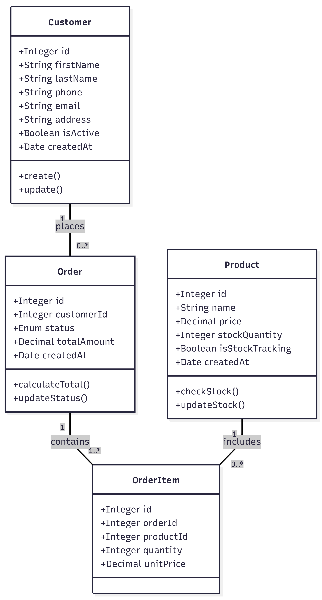
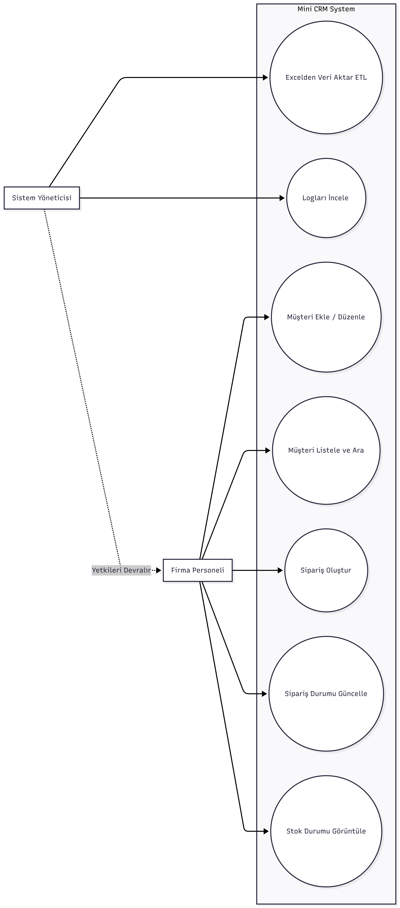
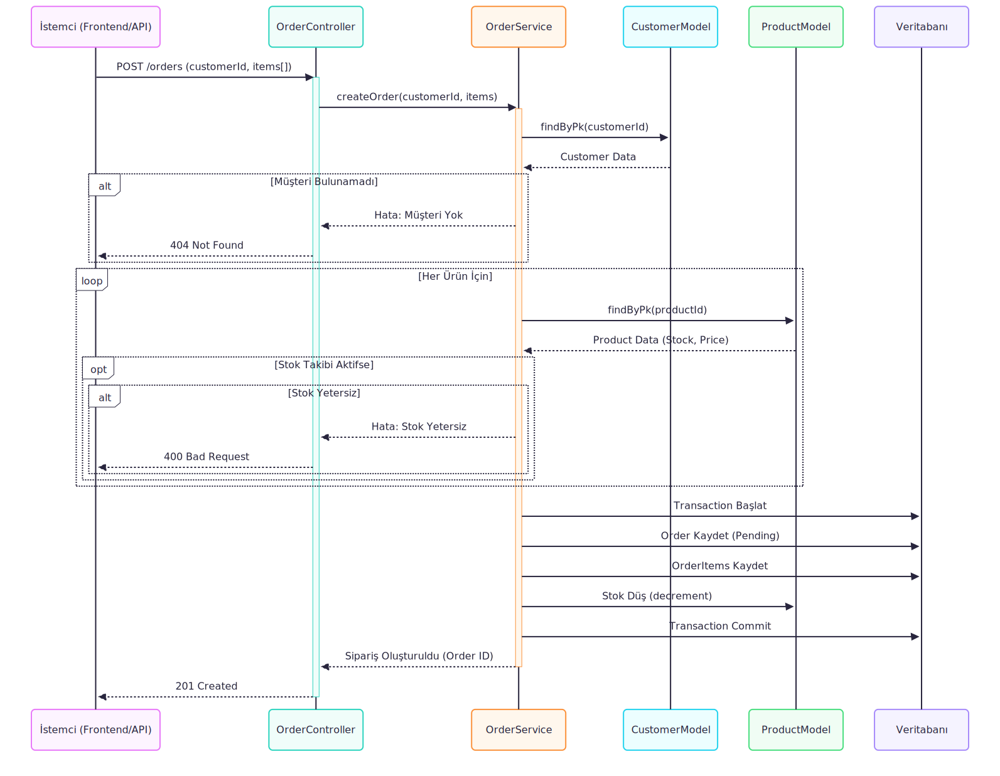

# Gereksinim Analizi ve Tasarım Dokümanı

### 1. Gereksinim Analizi Soru Listesi

**Müşteri Yönetimi İle İlgili Sorular:**
* **Soyadı Olmayan Müşteriler:** Veritabanında soyadı alanı boş bırakılabilir (nullable) yapıda mı kurgulanmalı, yoksa soyadı olmayan kayıtlar için varsayılan bir değer mi atanmalı?
* **Adres Zorunluluğu:** Adres bilgisi sipariş oluşturulurken zorunlu tutulup, sadece ilk müşteri kaydı açılırken mi opsiyonel bırakılmalı?
* **Mükerrer Kayıtlar:** Müşteri tekilleştirme işlemi sadece Ad ve Soyad üzerinden mi yapılmalı, yoksa Telefon Numarası veya E-posta bilgisi birincil ayırt edici olarak mı kabul edilmeli?

**Ürün ve Stok İle İlgili Sorular:**
* **Stok Takibi:** Stok takibi yapılmayan ürünler için sistemde stok miktarı sınırsız mı kabul edilmeli, yoksa ürün kartına stok takibinin yapılıp yapılmayacağını belirten bir alan mı eklenmeli?
* **Fiyatlandırma:** Birden fazla fiyat türü ifadesi ile kastedilen yapı (Nakit/Taksitli veya Toptan/Perakende) nedir? Mevcut fazda her ürün için tek bir Birim Satış Fiyatı tanımlanması yeterli midir?

**Sipariş İle İlgili Sorular:**
* **Kayıtsız Sipariş:** Müşteri bilgileri sistemde yoksa, sipariş anında hızlıca yeni bir müşteri kaydı mı oluşturulmalı, yoksa sipariş tamamen anonim olarak mı kaydedilmeli?
* **Stok Yetersizliği:** Sipariş anında stok yetersizse sistem işlemi engellemeli mi, yoksa eksi stok (Backorder) olarak siparişe izin mi vermeli?
* **Sipariş Durumları:** Sipariş durum akışı `Bekliyor` -> `Hazırlanıyor` -> `Kargolandı` -> `Teslim Edildi` -> `İptal` şeklinde kurgulanması uygun mudur?

---

### 2. Gereksinim Analiz Dokümanı

Bu doküman, proje gereksinimlerini, çözüm önerilerini ve projenin teknik yol haritasını içermektedir.

#### **Proje Tanımı**
E-ticaret firmasının mevcut süreçlerini dijitalleştiren, veri bütünlüğünü sağlayan, hataları minimize eden web tabanlı Mini CRM ve Sipariş Yönetim Sistemidir.

#### **Fonksiyonel Gereksinimler**

**A. Müşteri Modülü**
1. Sistem; müşterilerin Ad, Soyad, Telefon, E-posta ve Adres bilgilerini saklayacaktır.
2. Soyadı alanı veritabanında `nullable` olarak tasarlanacaktır.
3. Telefon numarası `unique` kabul edilecek ve mükerrer kayıt kontrolü bu alan üzerinden sağlanacaktır.
4. Müşteri silme işlemi Soft Delete yöntemiyle gerçekleştirilecektir.

**B. Ürün ve Stok Modülü**
1. Ürünlerin adı, stok adedi ve birim fiyatı sistemde tutulacaktır.
2. Ürün tablosuna `is_stock_tracking` alanı eklenecektir. Bu alanın `false` olduğu durumlarda stok düşümü yapılmayacak ve ürün satışa sürekli açık olacaktır.
3. Ürün fiyatları `Decimal` veri tipi kullanılarak saklanacaktır.

**C. Sipariş Modülü**
1. Siparişler, kayıtlı bir müşteri ile ilişkilendirilerek oluşturulacaktır.
2. Müşterisi olmayan siparişler için; sipariş ekranında Hızlı Müşteri Ekle özelliği bulunacak, sadece İsim ve Telefon girilerek arka planda müşteri kaydı oluşturulup sipariş bu kayıt ile ilişkilendirilecektir.
3. Sipariş durumları şu statülerle yönetilecektir: `PENDING`, `PREPARING`, `SHIPPED`, `DELIVERED`, `CANCELLED`.

**D. ETL (Veri Aktarım) Modülü**
1. Kaynak dosyalardaki hatalı formatlı veriler standardize edilerek sisteme aktarılacaktır.
2. Hatalı kayıtlar sistem işleyişini durdurmayacak, loglanarak raporlanacaktır.

#### **Teknik Gereksinimler**
* **Backend:** Node.js (Express.js)
* **Database:** PostgreSQL (Sequelize ORM)
* **Loglama:** Winston kütüphanesi ile dosya ve konsol loglaması (Trace ID destekli).
* **Test:** Jest ile birim ve entegrasyon testleri.

---

### 3. Mimari Tasarım Diyagramları

#### **Class Diagram (Sınıf Diyagramı)**

#### **Use Case Diagram (Kullanım Durumu Diyagramı)**

#### **Sequence Diagram (Sipariş Senaryosu)**
